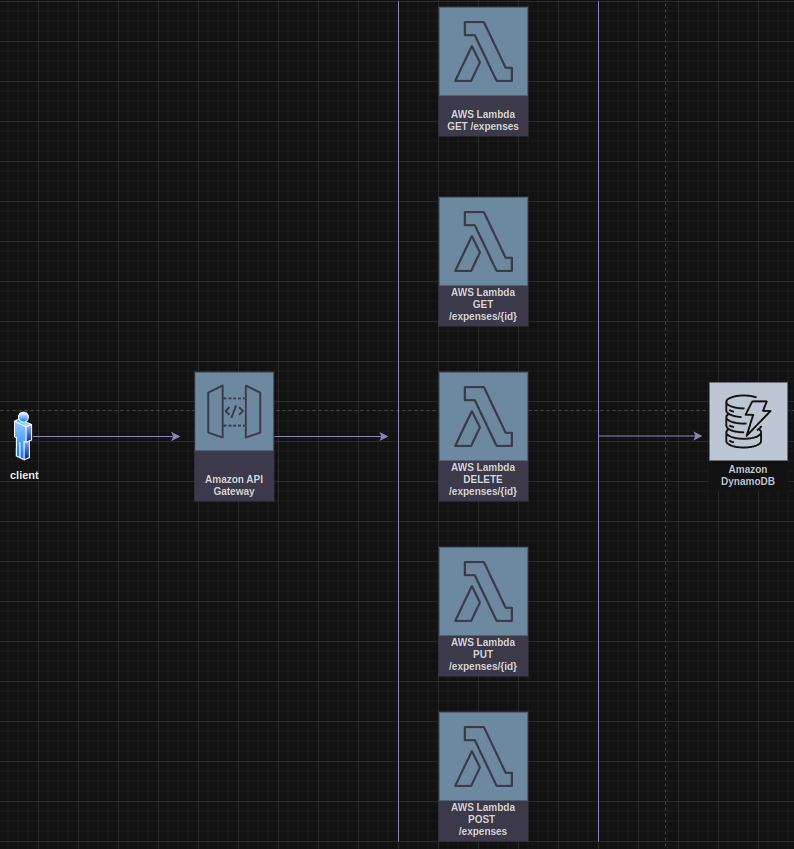

<h1 align="center">
  <br/>
  
  Expense Manager API
</h1>

<p align="center">
  

  
  
  <a href="https://github.com/LucasPereiraMiranda/expense-manager-api/commits/main">
    
  </a>

  <a href="https://github.com/LucasPereiraMiranda/expense-manager-api/issues">
    
  </a>

  <a href="https://github.com/LucasPereiraMiranda/expense-manager-api/issues">
    
  </a>
</p>

<br>


## 🚀 Techs

Expense Manager API was developed with these technologies:

- [Node.js](https://nodejs.org/)
- [NPM](https://www.npmjs.com/)
- [DynamoDB](https://aws.amazon.com/dynamodb/)
- [Serverless Framework](https://www.serverless.com/)
- [AWS Lambda](https://aws.amazon.com/lambda/)
- [TypeScript](https://www.typescriptlang.org/)
- [Zod](https://zod.dev/)

## 💻 Project

This project is a serverless application with five lambda functions, designed to manage expenses using a CRUD (Create, Read, Update, Delete) interface with DynamoDB as the data store, as described above:




The developed functions are the following:

- **getExpenses lambda function**:
  - Exposes an HTTP GET endpoint at /expenses via API Gateway.
  - Retrieves all expense records from the DynamoDB table.
  - Returns a list of expenses in JSON format.

- **getExpenseById lambda function**:
  - Exposes an HTTP GET endpoint at /expenses/{id} via API Gateway.
  - Validates incoming payloads to ensure data integrity.
  - Retrieves a specific expense record from the DynamoDB table based on the provided id.

- **createExpense lambda function**:
  - Exposes an HTTP POST endpoint at /expenses via API Gateway.
  - Validates incoming payloads to ensure data integrity.
  - Creates a new expense record in the DynamoDB table.

- **updateExpenseById lambda function**:
  - Exposes an HTTP PUT endpoint at /expenses via API Gateway.
  - Validates incoming payloads to ensure data integrity.
  - Updates the specified expense record in the DynamoDB table based on the provided id.

- **deleteExpenseById lambda function**:
  - Exposes an HTTP DELETE endpoint at /expenses/{id} via API Gateway.
  - Validates incoming payloads to ensure data integrity.
  - Deletes the specified expense record from the DynamoDB table based on the provided id.

We can see the following preview on aws console lambdas after deploy:


## :boom: Installation

Follow these steps to set up the project with the Serverless Framework:

```bash
# Clone this repo
$ git clone git@github.com:LucasPereiraMiranda/expense-manager-api.git

# Navigate to the project directory
$ cd expense-manager-api

# Use Node 22 with .nvmrc reference
$ nvm use

# Install dependencies
$ npm install

# Install Serverless Framework globally
$ npm install -g serverless

# Deploy the serverless services to AWS after define your credentials with aws cli
$ serverless deploy

```

## License

[MIT](LICENSE)